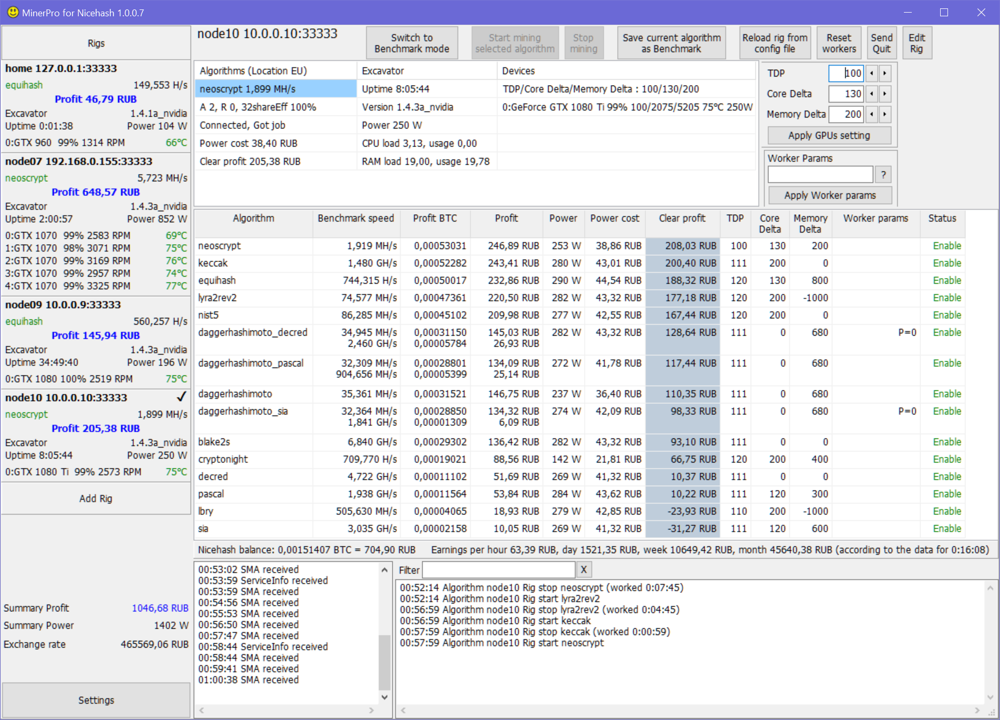

# MinerPro for NiceHash

([Перейти на русскую версию документации](README_RU.md))

Attention! Excavator versions 1.5. * Are not yet supported! Use version 1.4. *.

- [Features](#features)
- [Near future](#Nearfuture)
- [How to prepare an Excavator?](#PrepareExcavator)
- [How to Use MinerPro for NiceHash?](#HowtoUseMinerProforNiceHash)



# <a name="features"></a> Features
- The calculation of profits is made taking into account the cost of electricity. Including different cost of electricity during the day.
- Individual overclocking GPUs for each algorithm.
- Fine-tuning the parameters of algorithms.
- Ability to change parameters of the overclocking during operation.
- Fast, less than one second, switch between algorithms.
- Failover - switching to other locations when the stratum server fails.
- Caching Nicehash SMA data.
- Supported currency USD, CHF, HRK, MXN, ZAR, INR, CNY, THB, AUD, ILS, KRW, JPY, PLN, GBP, IDR, HUF, PHP, TRY, RUB, HKD, ISK, EUR, DKK, CAD, MYR, BGN, NOK, RON, SGD, CZK, SEK, NZD, BRL.
- Integration with android application Nicehash Statistic (https://play.google.com/store/apps/details?id=ru.flintnet.NiceHashStat). Now you will receive push-notifications about stopping rigs. Also in the mobile application you can watch MinerPro logs
- Dev fee 0.8% (one minute in two hours).

# <a name="Nearfuture"></a> Near future
- A mobile application for Android that receives push messages about critical problems and allows you to remotely view the main logs. (Already done)

# <a name="PrepareExcavator"></a> How to prepare an Excavator?

1. Download Excavator from [https://github.com/nicehash/excavator](https://github.com/nicehash/excavator) and unpack to the folder
2. Create the [ExcavatorServer.json](https://github.com/EvgeniyKorepov/MinerPro-for-NiceHash/blob/master/ExcavatorServer.json) configuration file in the Excavator folder and change it according to the number of GPUs:
```json
[
  {"time":15,"loop":15,"commands":[{"id":1,"method":"algorithm.print.speeds","params":[]}]},
  {"event":"on_quit","commands":[{"id":1,"method":"device.set.tdp","params":["0","100"]},
  {"id":1,"method":"device.set.core_delta","params":["0","0"]},
  {"id":1,"method":"device.set.memory_delta","params":["0","0"]}]}
]
 ```
3. Create cmd file [#start.cmd](https://github.com/EvgeniyKorepov/MinerPro-for-NiceHash/blob/master/%23start.cmd) in Excavator folfer 
```
@echo off
SET LOCALDIR=%~dp0
SET CONSOLE_LOG_LEVEL=2
SET FILE_LOG_LEVEL=2
SET WEB_PORT=38080
SET WEB_HOST=0.0.0.0
SET TOKEN=MyCoolToken
SET PORT=33333
SET HOST=0.0.0.0
SET RESTART_DELAY=0
cd /d "%LOCALDIR%"
:start
SET COMMAND_FILE=ExcavatorServer.json
excavator.exe -c %LOCALDIR%%COMMAND_FILE% -d %CONSOLE_LOG_LEVEL% -f %FILE_LOG_LEVEL% -wp %WEB_PORT% -wi %WEB_HOST% -wa %TOKEN% -p %PORT% -i %HOST%  
timeout /T %RESTART_DELAY%
goto start
```
4. Run the file #start.cmd once, in the favorite way - auto-load, task scheduler, etc.

# <a name="HowtoUseMinerProforNiceHash"></a> How to Use MinerPro for NiceHash?

 [Short training video on youtube](https://youtu.be/zN5rWmuU2mc)
 
1. [Prepare Excavator](#PrepareExcavator)
2. Download latest version https://github.com/EvgeniyKorepov/MinerPro-for-NiceHash/releases, unpak and run MinerProForNicehash.exe
3. When you first start, you will go to the Settings page - select the currency and click Save.
4. The main application section opens. In the left part, in the List of rigs, at the bottom, click the "Add Rig" button.
5. You will be taken to the section of adding rigs. Here you need to go through three stages of configuration:
- Choose the name of Rig (it will also be the name of the worker in Nicehash), enter your Bitcoin address, Autorun minig, preferred location and failover locations, enter the cost according to your electricity tariff in the currency selected in the Settings. Click Save.
- Select the preferred method of access to the Excavator API (HTTP or TCP), the excavator host (127.0.0.1 if local or the IP address of the computer if remotely). When selecting HTTP, you can specify a secret Access token (the same as in the excavator's run file). Click Save.
- If everything is specified correctly, a connection to the Excavator will occur and you will see a list of available GPUs for mining. Mark the GPUs you want to add to Rig. Add to the Rig can be exactly the same type of GPU, if there are several types of GPU on the farm, then you need to create a separate Rig for each type. Click Save and you will be taken to the Main application section.
6. Continuation in the process of writing ....
