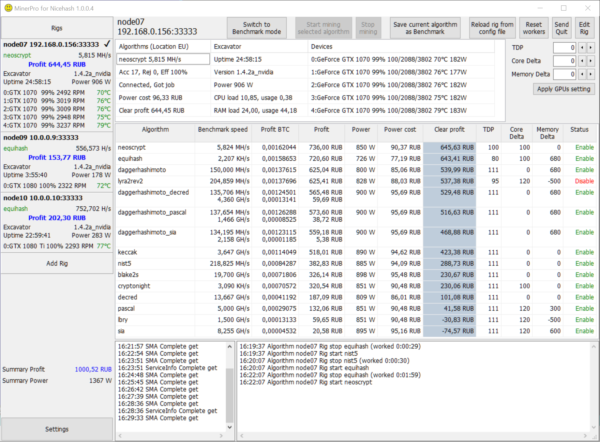

# MinerPro for NiceHash
NiceHash Miner Pro

- [Features](#features)
- [Near future](#Nearfuture)
- [How to prepare an Excavator?](#PrepareExcavator)
- [How to Use MinerPro for NiceHash?](#HowtoUseMinerProforNiceHash)



# <a name="features"></a> Features
- The calculation of profits is made taking into account the cost of electricity. Including different cost of electricity during the day.
- Individual overclocking GPUs for each algorithm.
- Fine-tuning the parameters of algorithms.
- Ability to change parameters of the overclocking during operation.
- Fast, less than one second, switch between algorithms.
- Failover - switching to other locations when the stratum server fails.
- Caching Nicehash SMA data.
- Dev fee 0.8% (one minute in two hours).

# <a name="Nearfuture"></a> Near future
- A mobile application for Android that receives push messages about critical problems and allows you to remotely view the main logs.

# <a name="PrepareExcavator"></a> How to prepare an Excavator?

1. Download Excavator from [https://github.com/nicehash/excavator](https://github.com/nicehash/excavator) and unpack to the folder
2. Create the [ExcavatorServer.json](https://github.com/EvgeniyKorepov/MinerPro-for-NiceHash/blob/master/ExcavatorServer.json) configuration file in the Excavator folder and change it according to the number of GPUs:
```json
[
  {"time":15,"loop":15,"commands":[{"id":1,"method":"algorithm.print.speeds","params":[]}]},
  {"event":"on_quit","commands":[{"id":1,"method":"device.set.tdp","params":["0","100"]},
  {"id":1,"method":"device.set.core_delta","params":["0","0"]},
  {"id":1,"method":"device.set.memory_delta","params":["0","0"]}]}
]
 ```
3. Create cmd file #start.cmd in Excavator folfer 
```
@echo off
SET CONSOLE_LOG_LEVEL=2
SET FILE_LOG_LEVEL=6
SET HTTP_PORT=38080
SET HTTP_HOST=0.0.0.0
SET HTTP_TOKEN=MySecurityToken
SET TCP_PORT=33333
SET TCP_HOST=0.0.0.0
SET COMMAND_FILE=ExcavatorServer.json
cd /d "%~dp0"
:start
excavator.exe -c %COMMAND_FILE% -d %CONSOLE_LOG_LEVEL% -f %FILE_LOG_LEVEL% -p 0 -wp %HTTP_PORT% -wi %HTTP_HOST% -wa %HTTP_TOKEN% -p %TCP_PORT% -i %TCP_HOST%
goto start
```
4. Run the file #start.cmd once, in the favorite way - auto-load, task scheduler, etc.

# <a name="HowtoUseMinerProforNiceHash"></a> How to Use MinerPro for NiceHash?

 [Short training video on youtube](https://youtu.be/zN5rWmuU2mc)
 
1. [Prepare Excavator](#PrepareExcavator)
2. Download latest version https://github.com/EvgeniyKorepov/MinerPro-for-NiceHash/releases, unpak and run MinerProForNicehash.exe
3. Choose your favorite currency and press button Save
4. In the left part of the application, click "Add Rig" and (I'll finish the rest later ...)
